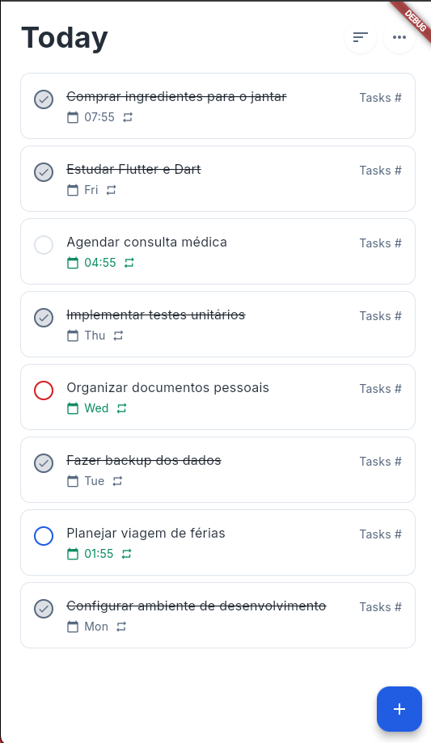
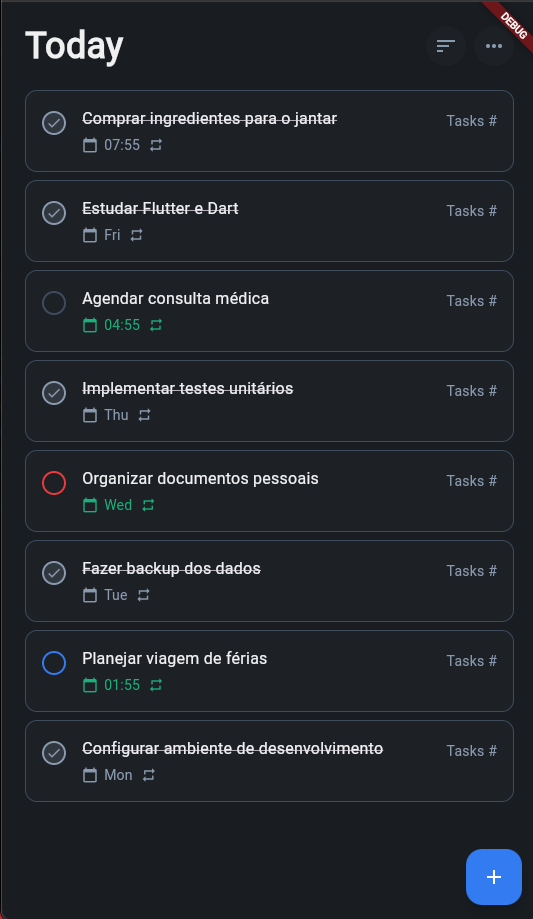

# Task Management App - Flutter Clean Architecture Demo

A Flutter task management application demonstrating clean architecture principles, including **Command Pattern**, **Result Pattern**, custom theming for light and dark modes, and separation of concerns.

## Screenshots

<div align="center">
  
  
</div>

## Overview

This project serves as a practical demonstration of advanced Flutter development patterns and clean architecture fundamentals. It showcases how to build maintainable, testable, and scalable applications using industry-standard architectural patterns.

## Key Features

### Architecture Patterns

#### 1. **Result Pattern**
A functional approach to error handling that encapsulates operations that may fail in a type-safe manner, avoiding uncaught exceptions and making code more predictable.

**Benefits:**
- Type safety - forces explicit handling of both success and error cases
- Composability - allows elegant chaining of operations with `map` and `flatMap`
- Predictability - makes it explicit in the return type that operations can fail
- Testability - easier to test error scenarios

**Example:**
```dart
Future<Result<User>> loginUser(String email, String password) async {
  return await validateCredentials(email, password)
    .flatMapAsync((credentials) => authenticateUser(credentials))
    .flatMapAsync((user) => loadUserPreferences(user))
    .map((user) => user.copyWith(lastLogin: DateTime.now()));
}

// Usage
final result = await loginUser(email, password);
result.when(
  onOk: (user) => navigateToHome(user),
  onError: (error) => showError(error.message),
);
```

#### 2. **Command Pattern**
Encapsulates asynchronous operations with built-in state management for loading, error, and success states. Integrates seamlessly with Flutter's `ChangeNotifier` for reactive UI updates.

**Features:**
- Automatic state tracking (`running`, `completed`, `error`)
- Built-in result caching
- Easy integration with UI components
- Support for parameterless (`Command0`) and single-parameter (`Command1`) commands

**Example:**
```dart
class TaskViewModel extends ChangeNotifier {
  late final Command0<List<TaskModel>> getAllTasks;
  late final Command1<TaskModel, TaskModel> createTask;

  TaskViewModel({required TaskRepository repository}) {
    getAllTasks = Command0(() => repository.getAllTasks());
    createTask = Command1((task) => repository.createTask(task: task));
  }
}

// In UI
if (viewModel.getAllTasks.running) {
  return CircularProgressIndicator();
}
if (viewModel.getAllTasks.error) {
  return Text('Error: ${viewModel.getAllTasks.errorMessage}');
}
return ListView(children: viewModel.tasks);
```

### 3. **Clean Architecture**
The project follows clean architecture principles with clear separation of concerns:

```
lib/
├── domain/           # Business entities and models
│   └── models/
├── data/            # Data layer
│   ├── repositories/
│   └── services/
├── ui/              # Presentation layer
│   ├── core/        # Themes, extensions
│   └── todo/        # Feature modules
│       ├── viewmodel/
│       └── widget/
├── utils/           # Shared utilities
│   ├── result.dart  # Result pattern implementation
│   └── command.dart # Command pattern implementation
└── config/          # App configuration
```

### 4. **Custom Theming System**
Complete theme system supporting both light and dark modes with custom color schemes:

- **Light Theme:** Clean, modern interface with subtle shadows
- **Dark Theme:** OLED-friendly dark mode with carefully selected contrast ratios
- **Theme Extensions:** Custom color extensions for consistent styling
- **Responsive Components:** Cards, buttons, inputs fully themed

**Example:**
```dart
MaterialApp.router(
  themeMode: ThemeMode.system,
  theme: AppTheme.lightTheme,
  darkTheme: AppTheme.darkTheme,
  // ...
);
```

## Technical Stack

### Dependencies
- **flutter**: UI framework
- **go_router**: Declarative routing solution
- **provider**: State management
- **dio**: HTTP client for API requests
- **supabase_flutter**: Backend and database integration
- **uuid**: Generate unique identifiers
- **equatable**: Value equality for models
- **logger**: Advanced logging capabilities

### Dev Dependencies
- **flutter_test**: Unit and widget testing
- **mocktail**: Mocking library for tests
- **bloc_test**: Testing utilities
- **flutter_lints**: Code quality enforcement

## Core Concepts

### Result Pattern Deep Dive

The `Result<T>` type represents operations that can either succeed (`Ok<T>`) or fail (`Error<T>`):

```dart
sealed class Result<T> {
  const factory Result.ok(T value) = Ok._;
  const factory Result.error(AppException error) = Error._;

  // Transformation methods
  Result<R> map<R>(R Function(T value) transform);
  Result<R> flatMap<R>(Result<R> Function(T value) transform);
  Future<Result<R>> mapAsync<R>(Future<R> Function(T value) transform);
  Future<Result<R>> flatMapAsync<R>(Future<Result<R>> Function(T value) transform);

  // Extraction methods
  void when({
    required void Function(T value) onOk,
    required void Function(AppException error) onError,
  });

  R fold<R>({
    required R Function(T value) onOk,
    required R Function(Exception error) onError,
  });
}
```

**Pipeline Example:**
```dart
final result = await validateEmail(email)
  .flatMap((validEmail) => findUser(validEmail))
  .flatMapAsync((user) => loadUserData(user.id))
  .mapAsync((data) => enrichUserData(data));
```

### Command Pattern Implementation

Commands wrap asynchronous operations and track their execution state:

```dart
abstract class Command<T> extends ChangeNotifier {
  bool get running;      // Operation in progress
  bool get error;        // Operation failed
  bool get completed;    // Operation succeeded
  Result<T>? get result; // Last result
  T? get value;          // Success value or null
  AppException? get exception; // Error or null
}

class Command0<T> extends Command<T> {
  Future<void> execute();
}

class Command1<T, A> extends Command<T> {
  Future<void> execute(A argument);
}
```

### Repository Pattern

Clean separation between data sources and business logic with two implementations:

```dart
abstract class TaskRepository {
  Future<Result<List<TaskModel>>> getAllTasks();
  Future<Result<TaskModel>> getTaskBy({required String taskId});
  Future<Result<TaskModel>> createTask({required TaskModel task});
  Future<Result<TaskModel>> updateTask({required TaskModel task});
  Future<Result<dynamic>> deleteTask({required String taskId});
}
```

#### TaskRepositoryMock (Default)
Mock implementation using in-memory data for development and testing:
- **No API calls** - works offline
- **Instant responses** - no network latency
- **Predictable data** - same mock data every time
- **Perfect for development** - no backend needed

```dart
// Used by default in lib/config/dependencies.dart
Provider(
  create: (context) => TaskRepositoryMock() as TaskRepository,
),
```

#### TaskRepositoryImpl (Real API)
Real implementation making HTTP requests to backend API:
- **Real data** - fetches from actual backend
- **Full CRUD operations** - complete API integration
- **Error handling** - network and server errors
- **Production ready** - use when backend is available

```dart
// To use: uncomment in lib/config/dependencies.dart
Provider(
  create: (context) =>
      TaskRepositoryImpl(
            apiService: context.read<ApiClient>(),
            baseUrl: "https://your-api-url.com/api",
            logger: context.read<CustomLogger>(),
          )
          as TaskRepository,
),
```

## Project Structure

### Layer Responsibilities

**Domain Layer (`domain/`)**
- Pure business logic
- Entity models
- No framework dependencies

**Data Layer (`data/`)**
- Repository implementations
- API service integration
- Data transformations
- External service communication

**Presentation Layer (`ui/`)**
- ViewModels (using Command pattern)
- Widgets and screens
- UI logic and state
- Theme definitions

**Utils (`utils/`)**
- Result pattern implementation
- Command pattern implementation
- Shared utilities and extensions
- Logging and error handling

## Getting Started

### Prerequisites
- Flutter SDK 3.10.0 or higher
- Dart 3.10.0 or higher

### Installation

1. Clone the repository
```bash
git clone <repository-url>
cd best_practices
```

2. Install dependencies
```bash
flutter pub get
```

3. Run the app
```bash
flutter run
```

### Switching Repository Implementations

The app uses **TaskRepositoryMock** by default, which provides mock data without requiring a backend. To switch to the real API implementation:

1. Open [lib/config/dependencies.dart](lib/config/dependencies.dart)

2. Uncomment the `TaskRepositoryImpl` import:
```dart
import 'package:best_practices/data/repositories/task/task_repository_impl.dart';
```

3. Comment out the mock provider and uncomment the real API provider:
```dart
// Default: Mock repository (no API calls, uses in-memory data)
// Provider(
//   create: (context) => TaskRepositoryMock() as TaskRepository,
// ),

// Alternative: Real API repository
Provider(
  create: (context) =>
      TaskRepositoryImpl(
            apiService: context.read<ApiClient>(),
            baseUrl: "https://your-api-url.com/api", // Update with your API URL
            logger: context.read<CustomLogger>(),
          )
          as TaskRepository,
),
```

4. Update the `baseUrl` with your actual API endpoint

5. Hot restart the app

This design allows you to:
- **Develop offline** using mock data
- **Test different scenarios** with controlled mock data
- **Switch to production** by simply changing the dependency injection
- **Run integration tests** against real API when needed

### Running Tests
```bash
flutter test
```

## Architecture Benefits

### Testability
- **Pure functions:** Result and Command patterns enable pure, testable functions
- **Mocking:** Repository pattern makes mocking data sources trivial
- **Isolation:** Clean architecture allows testing layers in isolation

### Maintainability
- **Separation of concerns:** Each layer has a single responsibility
- **Explicit error handling:** Result pattern makes error flows visible
- **Type safety:** Strong typing prevents runtime errors

### Scalability
- **Modular structure:** Easy to add new features without affecting existing code
- **Reusable patterns:** Result and Command patterns applicable across features
- **Clear boundaries:** Layer separation allows team collaboration

## Learning Resources

This project demonstrates concepts from:
- **Clean Architecture** by Robert C. Martin
- **Domain-Driven Design** principles
- **Functional Programming** patterns in Dart
- **Flutter Best Practices** for enterprise applications

## Key Takeaways

1. **Result Pattern eliminates try-catch hell** and makes error handling explicit
2. **Command Pattern simplifies async state management** in UI components
3. **Clean Architecture enables testing** without UI or external dependencies
4. **Custom theming systems** provide consistent, maintainable styling
5. **Separation of concerns** makes code easier to understand and modify

## Future Enhancements

Potential additions to explore:
- [ ] Integration tests with mock backend
- [ ] Offline-first architecture with local database
- [ ] Advanced error recovery strategies
- [ ] Performance optimization techniques
- [ ] Accessibility improvements
- [ ] Internationalization (i18n)

## License

This project is for educational purposes.

## Contributing

This is a demonstration project, but feedback and suggestions are welcome through issues.

---

**Built with Flutter** | **Demonstrating Clean Architecture Principles**
